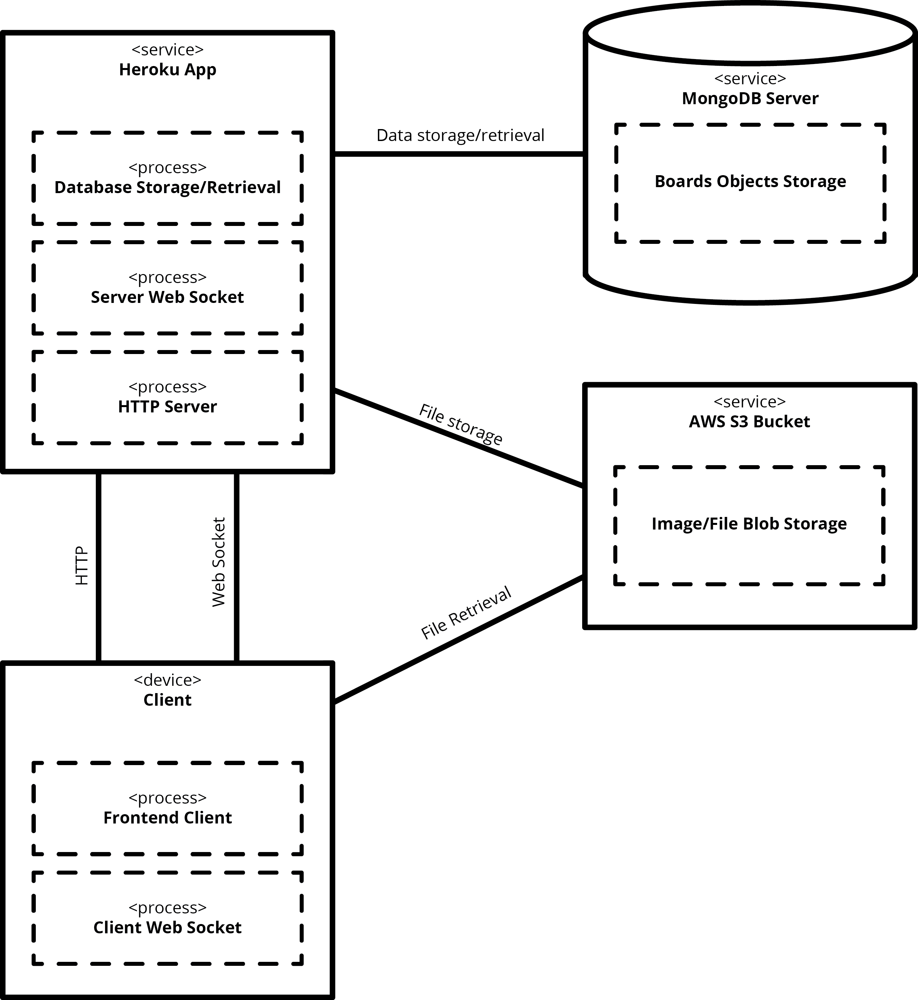

# InfinityBoard
## Kyle Combes, Matt Brucker, Tobias Shapinsky

InfinityBoard is a digital canvas with real-time collaborative editing
for sharing pictures and text. The ability to pan infinitely means
you'll never run out of collaborative and creative space.


# Documentation

  * [Frontend React app](http://htmlpreview.github.io/?https://github.com/olinlibrary/infinity-board/blob/master/docs/app.html)
  * [Backend server](http://htmlpreview.github.io/?https://github.com/olinlibrary/infinity-board/blob/master/docs/server.html)



# Running InfinityBoard locally

In order to run a local instance of InfinityBoard, you'll need to do a
few things, including setting up the backend server and the React frontend. For image upload functionality,
you'll also need to configure an AWS S3 bucket, described later.

## Setup MongoDB

InfinityBoard uses a MongoDB database to store the board data. Using the
MongoDB Atlas cloud hosting can make setting up a MongoDB instance a breeze.
The [Getting Started guide](https://docs.atlas.mongodb.com/getting-started/)
is a great resource to help setting that up.

## Setup an AWS S3 bucket

These instructions are based off of [this tutorial](https://docs.aws.amazon.com/sdk-for-javascript/v2/developer-guide/s3-example-photo-album.html). First, you'll need [an AWS account.](https://aws.amazon.com/premiumsupport/knowledge-center/create-and-activate-aws-account/). Next, create an [S3 bucket](https://docs.aws.amazon.com/AmazonS3/latest/user-guide/create-bucket.html) and ensure you have access to it. You'll also need to set the CORS policy as follows:

```
<?xml version="1.0" encoding="UTF-8"?>
<CORSConfiguration xmlns="http://s3.amazonaws.com/doc/2006-03-01/">
    <CORSRule>
        <AllowedOrigin>*</AllowedOrigin>
        <AllowedMethod>POST</AllowedMethod>
        <AllowedMethod>GET</AllowedMethod>
        <AllowedMethod>PUT</AllowedMethod>
        <AllowedMethod>DELETE</AllowedMethod>
        <AllowedMethod>HEAD</AllowedMethod>
        <AllowedHeader>*</AllowedHeader>
    </CORSRule>
</CORSConfiguration>
```
Then, create an [IAM user](https://docs.aws.amazon.com/IAM/latest/UserGuide/id_users_create.html) and attach the following policy to it:

```
{
   "Version": "2012-10-17",
   "Statement": [
      {
         "Effect": "Allow",
         "Action": [
            "s3:*"
         ],
         "Resource": [
            "arn:aws:s3:::BUCKET_NAME/*"
         ]
      }
   ]
}
```

where `BUCKET_NAME` is the name you gave to the bucket. Now, [create an API key for your IAM user](https://docs.aws.amazon.com/IAM/latest/UserGuide/id_credentials_access-keys.html) - you'll use this to set up the environment in the next step.

## Server/client setup - local

#### Set environment variables

First, make create a file called `.env` in the root of the project.
Then paste the following in that file and fill in the appropriate values:
```
# MongoDB Settings
MONGO_USERNAME=""
MONGO_PASSWORD=""
MONGO_PORT=
MONGO_CLUSTER1=""
MONGO_CLUSTER2=""
MONGO_CLUSTER3=""
MONGO_DB_NAME=""
MONGO_REPLICA_SET=""

# AWS S3
AWS_ACCESS_KEY_ID=""
AWS_SECRET_ACCESS_KEY=""
AWS_S3_BUCKET_NAME=""
```

#### Install Node.js >8.5.0

If you don't have Node.js v8.5.0 or greater already,
[do that first](http://nodesource.com/blog/installing-node-js-tutorial-using-nvm-on-mac-os-x-and-ubuntu/).

If you can, install Yarn instead of NPM for package management (it's a lot faster).
If not, simply replace "yarn" with "npm" below.

#### Install dependencies

To install React, Express, and all the other Node modules needed by
InfinityBoard, simply run the following:

```bash
yarn install
```

#### Start the server

```
yarn run server
```

## Running the frontend app

In a separate terminal, simply run the following to launch the web app:

```bash
yarn run start
```

Now the frontend will be accessible from `http://localhost:8080/`.

# Tests

To run the Jest tests, run:
```bash
yarn run test
```

# Acknowledgements
Infinity Board is based on the original [FutureBoard](https://github.com/olinlibrary/oldfutureboard) project from Hacking the Library 2017.
